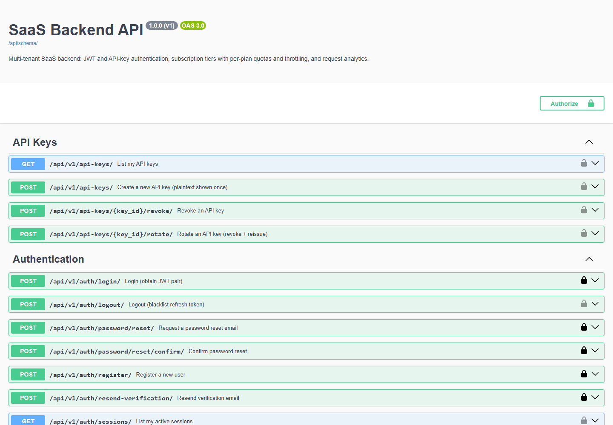
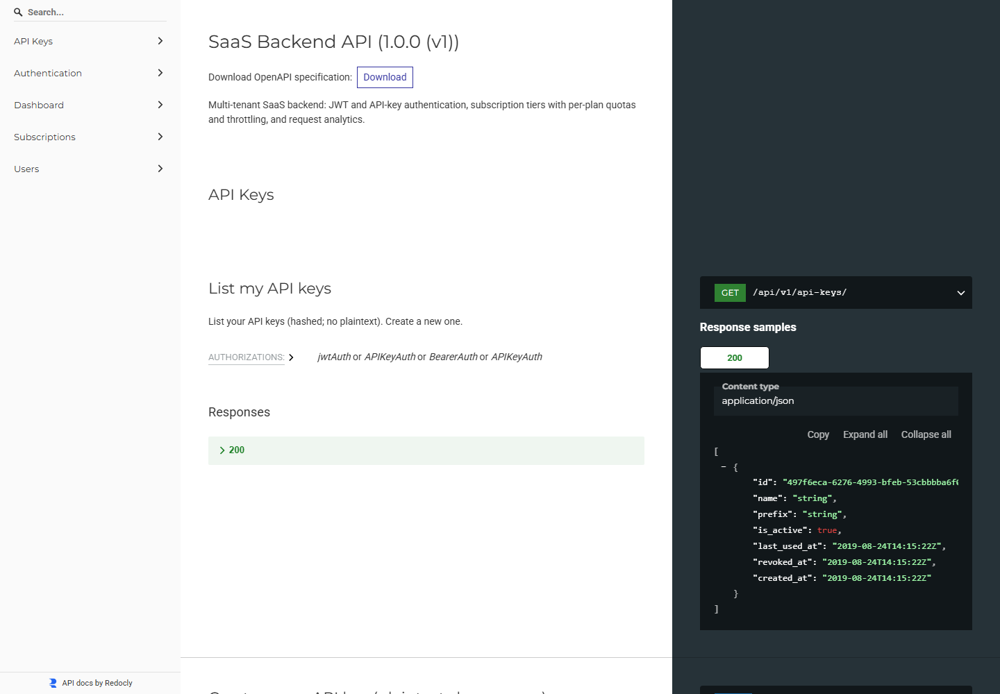

# SaaS Backend API

[](https://github.com/Eazydev-CEO/saas-backend-api/actions/workflows/ci.yml)
[](https://www.python.org/)
[](https://www.djangoproject.com/)
[](LICENSE)

A Django REST Framework backend for a multi-tenant SaaS product: JWT and API-key
authentication, subscription tiers with per-plan quotas and throttling, and request
analytics with pre-aggregated daily rollups. Runs on Docker with PostgreSQL, Redis,
and Celery.

The API surface is documented by a generated OpenAPI 3 schema, and the test suite
runs against a real PostgreSQL database in CI on every push.

---

## Screenshots

The generated OpenAPI schema, served by the running application:

| Swagger UI (`/api/docs/`) | Redoc (`/api/redoc/`) |
|---|---|
|  |  |

---

## Highlights

- **Clean architecture**: views → service layer → selectors → models. Business logic is reusable from CLI, Celery tasks, and admin.
- **JWT authentication** (SimpleJWT) with refresh-token rotation, blacklist on logout, and device/session tracking.
- **Hashed credential storage**: email verification tokens, password reset tokens, and API keys are all SHA-256 hashed in the database. Plaintext API keys are shown exactly once.
- **Subscription system** with Free/Pro/Enterprise tiers, per-period usage quotas, plan-aware feature flags, and a nightly expiry sweep.
- **Plan-scoped rate limiting** via DRF throttling backed by Redis — each plan gets its own bucket.
- **Append-only request audit log** + nightly pre-aggregated daily rollup; dashboard queries hit the rollup, not the raw logs.
- **OpenAPI 3 schema** auto-generated by drf-spectacular. Swagger UI and Redoc served out of the box.
- **Dockerized**: web, worker, beat, postgres, redis, mailhog all defined. Production compose adds nginx.
- **Centralized error envelope**: every error response is `{"error": {"code", "message", "details"}}` for frontends to parse uniformly.
- **Request tracing**: every response carries an `X-Request-ID` header; every log line carries the same ID.

---

## Tech Stack

| Layer | Choice |
|---|---|
| Runtime | Python 3.12 |
| Web framework | Django 5 + Django REST Framework 3.15 |
| Auth | djangorestframework-simplejwt + API key auth class |
| Database | PostgreSQL 16 (via psycopg 3) |
| Cache / broker | Redis 7 |
| Background jobs | Celery 5 + django-celery-beat |
| Docs | drf-spectacular (OpenAPI 3, Swagger UI, Redoc) |
| Reverse proxy | Nginx (prod) |
| App server | Gunicorn (prod) |
| Tests | pytest + pytest-django + factory-boy |
| Errors | Sentry (prod) |

---

## Architecture

```
HTTP request
   │
   ▼
[ Nginx ]  ──►  [ Gunicorn ]
                     │
                     ▼
              Django middleware stack
              ├── RequestIDMiddleware              (tracing)
              ├── RequestLoggingMiddleware         (access logs)
              ├── RequestAnalyticsMiddleware       (audit + quota)
              └── SubscriptionContextMiddleware    (attaches plan to request)
                     │
                     ▼
              DRF view (HTTP only)
                     │
                     ▼
              Service layer (business logic, transactions)
                     │
                     ├──► Selectors  → ORM (read)
                     ├──► Models     → ORM (write)
                     └──► Celery     → async work (email, rollups, expiry)
                                          │
                                          ▼
                                       Redis broker → worker / beat
```

App boundaries are bounded contexts, not Django conventions:

```
apps/
├── common/           Shared base models, exceptions, middleware, permissions, throttling
├── users/            User identity, profile, RBAC
├── authentication/   Registration, login, JWT, tokens, sessions, password reset
├── subscriptions/    Plans, subscriptions, usage quotas, billing state
├── api_keys/         Hashed key issuance, rotation, revocation, DRF auth class
├── analytics/        Request log, daily rollups, aggregation queries
└── dashboard/        Read-only endpoints composing the above for a UI
```

### Database (ERD summary)

- `User` (UUID PK, email, role enum, is_verified)
- `EmailVerificationToken` / `PasswordResetToken` (hashed, one-shot, TTL)
- `UserSession` (per-refresh-token; revoke/list endpoints)
- `Plan` (slug, price, request_quota, max_api_keys, features JSON)
- `Subscription` (user → plan; partial unique constraint enforces one active per user)
- `UsageQuota` (per subscription period; atomic F() increments)
- `APIKey` (user → key; prefix + sha256 hash, last_used_at)
- `RequestLog` (append-only, indexed on created_at)
- `DailyUsage` (rollup; unique on (user, date))

---

## Getting started (Docker — recommended)

```bash
cp .env.example .env                # adjust as needed
docker compose up --build           # postgres, redis, mailhog, web, worker, beat
```

Wait for the web container's startup log. Then:

| Service | URL |
|---|---|
| API root | http://localhost:8001/api/v1/ |
| Swagger UI | http://localhost:8001/api/docs/ |
| Redoc | http://localhost:8001/api/redoc/ |
| OpenAPI schema | http://localhost:8001/api/schema/ |
| Admin | http://localhost:8001/admin/ |
| Mailhog UI | http://localhost:8025/ |

Migrations and plan seeding run automatically on web container startup (controlled by `RUN_MIGRATIONS=true`).

### If a port is already in use

Ports 5432 and 6379 are commonly taken by another project's database. Every host-side
port is configurable in `.env`, so you can move this stack out of the way without
touching anything else:

```bash
POSTGRES_HOST_PORT=5442
REDIS_HOST_PORT=6389
WEB_HOST_PORT=8011
```

Only the host mapping changes — containers still reach each other on the standard
ports over the compose network, so no application configuration needs to change.

Create a superuser:

```bash
docker compose exec web python manage.py createsuperuser
```

---

## Getting started (local Python)

```bash
python3.12 -m venv .venv
source .venv/bin/activate
pip install -r requirements/development.txt

# Start Postgres + Redis + MailHog any way you like (Docker, brew, etc.)
# Then:
cp .env.example .env
export $(grep -v '^#' .env | xargs)
export POSTGRES_HOST=localhost
export REDIS_URL=redis://localhost:6379/0
export CELERY_BROKER_URL=redis://localhost:6379/1
export EMAIL_HOST=localhost

python manage.py migrate
python manage.py seed_plans
python manage.py runserver
```

In separate shells:

```bash
celery -A config worker --loglevel=info
celery -A config beat --loglevel=info --scheduler django_celery_beat.schedulers:DatabaseScheduler
```

---

## API tour

All endpoints under `/api/v1/`. Full schemas at `/api/docs/`.

### Authentication

| Method | Path | Description |
|---|---|---|
| POST | `/auth/register/` | Sign up. Sends verification email. |
| POST | `/auth/login/` | Obtain JWT pair. Rejects unverified accounts. |
| POST | `/auth/token/refresh/` | Refresh access token (rotates refresh; blacklists previous). |
| POST | `/auth/logout/` | Blacklist refresh token; revoke session. |
| POST | `/auth/verify-email/` | Body: `{"token": "..."}` |
| POST | `/auth/resend-verification/` | Body: `{"email": "..."}` |
| POST | `/auth/password/reset/` | Body: `{"email": "..."}` |
| POST | `/auth/password/reset/confirm/` | Body: `{"token", "new_password"}` |
| GET  | `/auth/sessions/` | List active sessions. |
| POST | `/auth/sessions/{id}/revoke/` | Revoke a session. |

### Users

| Method | Path | Description |
|---|---|---|
| GET/PATCH | `/users/me/` | Get/update current user. |
| POST | `/users/me/change-password/` | Change password (current + new). |
| GET | `/users/` | List users (Staff/Admin only). |

### Subscriptions

| Method | Path | Description |
|---|---|---|
| GET | `/subscriptions/plans/` | Public plan catalog. |
| GET | `/subscriptions/me/` | Current subscription + quota. |
| POST | `/subscriptions/subscribe/` | Body: `{"plan_slug"}` — subscribe / upgrade / downgrade. |
| POST | `/subscriptions/cancel/` | Cancel and downgrade to Free. |

### API Keys

| Method | Path | Description |
|---|---|---|
| GET/POST | `/api-keys/` | List, or create a new key (plaintext returned once). |
| POST | `/api-keys/{id}/revoke/` | Revoke a key. |
| POST | `/api-keys/{id}/rotate/` | Revoke + issue replacement. |

### Dashboard

| Method | Path | Description |
|---|---|---|
| GET | `/dashboard/overview/` | One-call overview: user, subscription, usage, key count. |
| GET | `/dashboard/usage/summary/?days=30` | Headline metrics. |
| GET | `/dashboard/usage/daily/?days=30` | Zero-filled daily chart series. |
| GET | `/dashboard/usage/monthly/?months=6` | Monthly bar chart series. |
| GET | `/dashboard/requests/recent/?limit=20` | Last N requests. |

### Authentication on requests

Two equivalent schemes are accepted on protected endpoints:

```http
Authorization: Bearer <JWT access token>
```

or

```http
X-API-Key: sk_live_<your_key>
```

---

## Configuration

All configuration is environment-driven (`django-environ`). See `.env.example`. Key variables:

| Variable | Purpose |
|---|---|
| `DJANGO_SETTINGS_MODULE` | `config.settings.development` \| `production` \| `test` |
| `DJANGO_SECRET_KEY` | Required. Long random string. |
| `DJANGO_DEBUG` | `False` in production. |
| `DJANGO_ALLOWED_HOSTS` | Comma-separated hostnames. |
| `POSTGRES_*` | DB credentials. |
| `REDIS_URL`, `CELERY_BROKER_URL`, `CELERY_RESULT_BACKEND` | Redis URLs. |
| `JWT_ACCESS_TOKEN_LIFETIME_MINUTES` | Default 15. |
| `JWT_REFRESH_TOKEN_LIFETIME_DAYS` | Default 7. |
| `EMAIL_*` | SMTP config. |
| `FRONTEND_URL` | Used to build verification / reset links. |
| `CORS_ALLOWED_ORIGINS` | Comma-separated allowed origins. |
| `SENTRY_DSN` | Optional, prod only. |

---

## Operations

### Background jobs

- `subscriptions.expire_due_subscriptions` — sweep nightly; mark expired, downgrade to Free.
- `analytics.rollup_daily_usage` — nightly rollup of yesterday's `RequestLog` into `DailyUsage`.
- `authentication.send_verification_email` / `send_password_reset_email` — dispatched on demand with exponential-backoff retry.

Schedule them in the Django admin under **Periodic tasks** (django-celery-beat lets you edit schedules without redeploying).

### Logging

Every request emits a structured access log line:

```
[2026-05-16 12:34:56,789] INFO apps.common.middleware req=a1b2c3 :: POST /api/v1/auth/login/ -> 200 in 42ms
```

The `request_id` is also returned in the `X-Request-ID` response header, so frontend logs and backend logs can be correlated.

### Error envelope

All errors look like this:

```json
{
  "error": {
    "code": "quota_exceeded",
    "message": "Monthly quota of 1000 requests exceeded for plan 'free'.",
    "details": {"plan": "free", "limit": 1000, "used": 1000}
  }
}
```

### Security baseline

- Argon2 password hashing.
- Strong-password validator (10+ chars, letter + digit + symbol).
- All tokens stored as SHA-256 hashes; plaintext only ever in transit.
- Constant-time hash comparison on API key auth path.
- JWT refresh-token rotation + blacklist.
- One-active-subscription DB constraint (partial unique index).
- CORS restricted by env var; HSTS + secure cookies enabled in production.
- SECURE_PROXY_SSL_HEADER set for HTTPS detection behind nginx/ALB.
- Sentry integration for production error capture.

---

## Testing

```bash
docker compose exec web pytest
# or locally
DJANGO_SETTINGS_MODULE=config.settings.test pytest
```

Test layout:

```
tests/
├── conftest.py          fixtures: api_client, auth_client, seeded plans
├── factories.py         factory-boy: User, Plan, Subscription, APIKey
├── test_authentication.py
├── test_subscriptions.py
├── test_api_keys.py
├── test_dashboard.py
└── test_common.py
```

---

## Production deployment

The `docker-compose.prod.yml` file defines the prod topology:

```
nginx (80)  →  gunicorn (web)  →  postgres
                    │
                    ├─→  redis  ←─  celery worker
                    │             ←─  celery beat
                    └─→  sentry (errors)
```

Build and run:

```bash
DJANGO_SETTINGS_MODULE=config.settings.production docker compose -f docker-compose.prod.yml up -d --build
```

Production checklist:

- [ ] Set a strong, unique `DJANGO_SECRET_KEY`.
- [ ] Set `DJANGO_DEBUG=False`.
- [ ] Configure `DJANGO_ALLOWED_HOSTS` for your domain.
- [ ] Configure `CORS_ALLOWED_ORIGINS` for your frontend domain.
- [ ] Real SMTP (`EMAIL_HOST`, `EMAIL_HOST_USER`, `EMAIL_HOST_PASSWORD`, `EMAIL_USE_TLS=True`).
- [ ] Configure `SENTRY_DSN`.
- [ ] Terminate TLS at nginx (or upstream ALB) and ensure `X-Forwarded-Proto: https` is set.
- [ ] Set up Celery beat schedules in `/admin` for `expire_due_subscriptions` and `rollup_daily_usage`.
- [ ] Configure `RequestLog` retention (Celery purge task — easy to add).
- [ ] Database backups & PITR for Postgres.
- [ ] Monitor `/health/` from your load balancer.

---

## Project layout (top level)

```
saas_backend/
├── apps/                 Bounded-context applications
├── config/               Django project (settings, urls, celery, wsgi/asgi)
├── nginx/                Production reverse-proxy config
├── requirements/         base / development / production
├── scripts/              entrypoint.sh, start-prod.sh
├── templates/emails/     HTML + plaintext email templates
├── tests/                Pytest suite
├── docker-compose.yml          Dev stack
├── docker-compose.prod.yml     Prod stack
├── Dockerfile                  Multi-stage; non-root runtime user
├── manage.py
├── pytest.ini
├── pyproject.toml
└── Makefile
```

---

## License

MIT.
